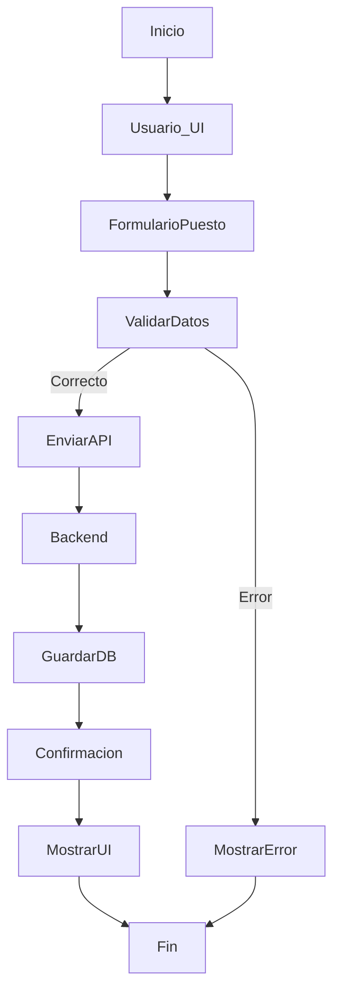
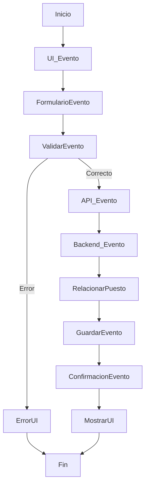
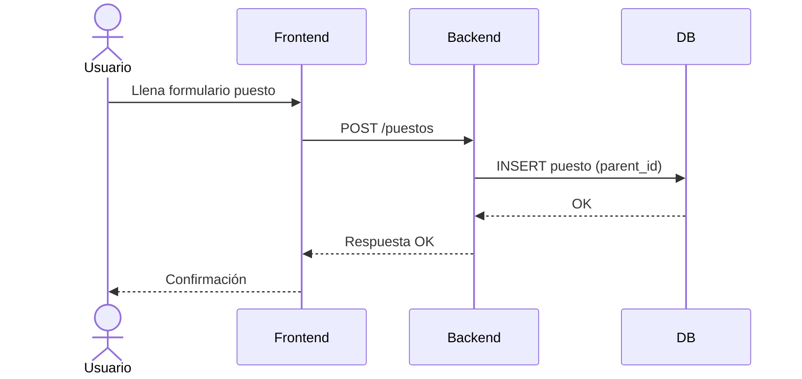

# 🧠 🔷 1. FLUJO GENERAL DEL SISTEMA

Primero entiende esto:

👉 Tu sistema tiene **3 entradas principales**:

1.  Crear puesto
2.  Crear evento/tarea
3.  Consultar datos

***

# 🔄 2. DIAGRAMA DE ACTIVIDAD — INGRESO DE DATOS

👉 Aquí se muestra **cómo el usuario ingresa información**

## ✅ Crear puesto (jerarquía)

📌 EXPLICACIÓN:

*   El usuario escribe:
    *   nombre del puesto
    *   puesto padre (jerarquía)
*   El sistema:
    *   valida datos
    *   guarda relación (parent\_id)

👉 Esto crea la estructura tipo árbol

***

## ✅ Crear evento/tarea

📌 EXPLICACIÓN:

*   El evento SIEMPRE se relaciona con un puesto
*   Se guarda con:
    *   puesto\_id
    *   fecha
    *   duración
    *   estado

***

# 🔗 3. DIAGRAMA DE SECUENCIA — FLUJO DETALLADO

## ✅ Crear puesto

***

## ✅ Crear evento (tarea)

***

# 🧩 4. DIAGRAMA DE CLASES (CÓMO SE ORGANIZA EL SISTEMA)

👉 Este explica **cómo se distribuyen los datos**

📌 EXPLICACIÓN IMPORTANTE:

*   `parent_id` crea la jerarquía
*   `puesto_id` conecta evento con puesto

👉 Esta es la base lógica del sistema

***

# 🌳 5. DIAGRAMA DE ESTRUCTURA (JERARQUÍA REAL)

👉 Cómo se distribuyen los puestos

📌 Interpretación:

*   Cada nivel depende del anterior
*   Los eventos cuelgan del puesto

***

# 🔁 6. DIAGRAMA DE COMUNICACIÓN

👉 Cómo interactúan los componentes

***

# 🔄 7. DIAGRAMA DE ESTADOS (EVENTO)

👉 Cómo cambia una tarea

📌 Esto es clave para lógica de negocio

***

# 🔍 8. DIAGRAMA DE ACTIVIDAD — CONSULTA DE DATOS

👉 Cómo se distribuyen los datos al usuario

📌 CLAVE:
👉 Aquí pasa lo más importante:

*   El backend convierte los datos en **estructura jerárquica**

***

# 🧠 9. EXPLICACIÓN GLOBAL DEL FUNCIONAMIENTO

👉 En palabras simples:

## 🔹 1. Ingreso de datos

*   Usuario crea puesto → se guarda con `parent_id`
*   Usuario crea evento → se guarda con `puesto_id`

***

## 🔹 2. Almacenamiento

Base de datos:

    PUESTOS
    - id
    - parent_id

    EVENTOS
    - puesto_id

***

## 🔹 3. Distribución

Cuando consultas:

👉 El sistema:

1.  Lee todos los puestos
2.  Reconstruye árbol
3.  Agrega eventos a cada nodo

***

## 🔹 4. Visualización

Frontend muestra:

*   Organigrama (estructura)
*   Calendario (eventos)

***
✅ Documento completo tipo **entrega final (.md)**\
✅ Explicación lista para exposición\
✅ Posibles preguntas del profe basadas en esto

Solo dime 😄
